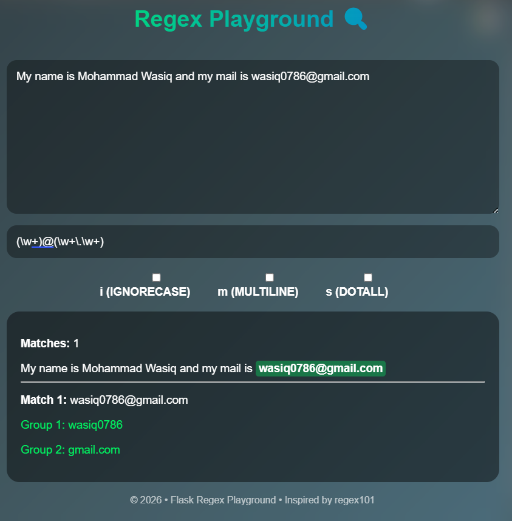

# 🔍 Regex Match Explorer – Flask Application

A lightweight, modern **Regex Testing Web Application** inspired by **regex101.com**, built using **Flask + Vanilla JavaScript**.

This app allows users to enter a **test string** and a **regular expression** and instantly see **all matches**, **groups**, **named captures**, **index positions**, and **inline highlighted results** — all with **live matching (no submit button)**.

---

## 🚀 Features

### 🧪 Core Regex Functionality
- Enter a **test string**
- Enter a **regular expression**
- **Live matching** (results update as you type)
- No page reloads

### 🎯 Matching Details
- Full list of matched strings
- Match **start & end index positions**
- **Capture groups**
- **Named capture groups**
- Inline **highlighting inside the test string**

### ⚙ Regex Flags
- `i` → Ignore case
- `m` → Multiline
- `s` → Dot matches newline

### 🧠 Regex Explanation
- Basic rule-based regex explanation
- Helps beginners understand common patterns

### 🎨 UI / UX
- Clean and modern interface
- Responsive grid-based layout
- Mobile-first design
- Dark theme inspired by developer tools
- Smooth updates without blinking

---

## 🖼 Application Preview

- Left panel: **Test String**
- Right panel: **Regex Input + Flags**
- Bottom panels:
  - Highlighted output
  - Match details & groups
  - Regex explanation

---

## 🔗 Example Use Case

### Test String
```

Contact: [john.doe@example.com](mailto:john.doe@example.com)
Support: [help@company.org](mailto:help@company.org)

```

### Regex
```

(?<email>[\w.-]+@[\w.-]+)

```

### Output
- Matches both email addresses
- Displays:
  - Match text
  - Index positions
  - Named group `email`

---

## 🛠 Tech Stack

| Layer       | Technology |
|------------|-----------|
| Backend    | Flask (Python) |
| Frontend  | HTML, CSS, JavaScript |
| Styling   | CSS Grid, Flexbox |
| Regex     | JavaScript RegExp Engine |

> ⚠️ Regex execution is done **entirely in the browser (JavaScript)** for instant feedback.

---

## 📂 Project Structure

```

.
├── app.py
└── README.md

````

✔ Single-file Flask application  
✔ No database  
✔ No external backend APIs  

---

## ⚙ Installation & Run

### 2️⃣ Install Flask

```bash
pip install flask
```

### 3️⃣ Run the Application

```bash
python app.py
```

### 4️⃣ Open in Browser

```
http://127.0.0.1:5000
```


## Application Review



---

## 🧠 Supported Regex Concepts

* Literals
* Character classes (`\d`, `\w`)
* Quantifiers (`+`, `*`, `?`)
* Capture groups `()`
* Named capture groups `(?<name>)`
* Global matching
* Multiline & dotall behavior

---

## ♿ UX & Stability Improvements

* Safe regex execution (try/catch)
* No UI flickering or blinking
* Inline highlights do not break layout
* Graceful handling of invalid regex

---