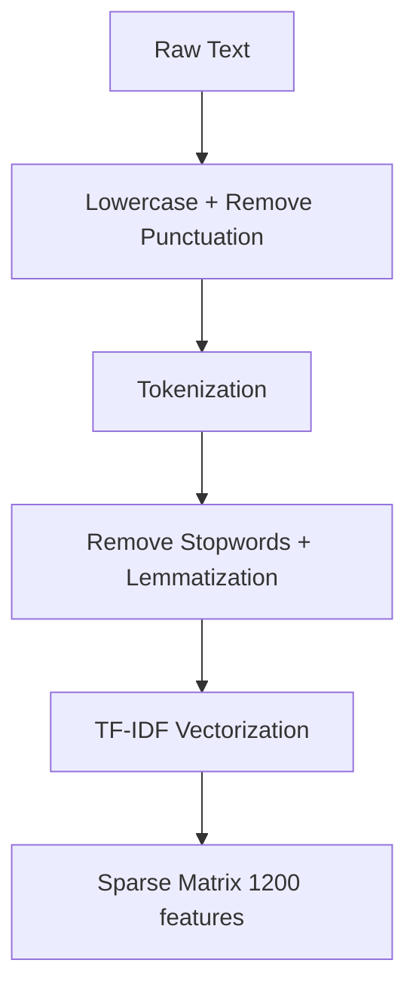

# Sentiment Intelligence with MLflow

**Enterprise-grade sentiment analysis platform with full MLflow integration for experiment tracking, hyperparameter tuning, model registry, and production deployment.**

## 🎯 Features

| Feature | Status | Description |
|---------|--------|-------------|
| 🔮 Real-time Prediction | ✅ Complete | Single/batch sentiment analysis |
| 📊 Model Insights | ✅ Complete | Feature importance, distributions |
| 🗃 Dataset Explorer | ✅ Complete | Interactive data visualization |
| 📈 MLflow Tracking | ✅ Complete | Params, metrics, artifacts logging |
| 🔧 Hyperparameter Tuning | ✅ Complete | Grid search with MLflow plots |
| 🏷️ Model Registry | ✅ Complete | Register + tag production models |
| 🚀 Streamlit Dashboard | ✅ Complete | Responsive web interface |

## 📋 Table of Contents
- [High-Level Design (HLD)](#hld)
- [Low-Level Design (LLD)](#lld)
- [Quick Start](#quick-start)
- [Architecture](#architecture)
- [MLflow Integration](#mlflow-integration)
- [API Endpoints](#api-endpoints)
- [Project Structure](#project-structure)
- [Configuration](#configuration)
- [Performance](#performance)
- [Troubleshooting](#troubleshooting)

## HLD (High-Level Design)

```
┌─────────────────┐    ┌──────────────────┐    ┌──────────────────┐
│   Streamlit UI  │◄──►│   MLflow Server  │◄──►│  Model Registry  │
│                 │    │  (localhost:5000)│    │                  │
└─────────┬───────┘    └───────┬──────────┘    └─────────┬─────────┘
          │                    │                         │
          │                    │                         │
          ▼                    ▼                         ▼
┌─────────────────┐    ┌──────────────────┐    ┌──────────────────┐
│   Prediction    │    │  Experiment      │    │   Registered     │
│   Engine        │    │   Tracking       │    │   Models v1.0+   │
└─────────────────┘    └──────────────────┘    └──────────────────┘
          ▲
          │
┌─────────────────┐
│  TF-IDF + RF    │
│  (Cached)       │
└─────────────────┘
          ▲
          │ 
      datanew.csv
```

### System Components
1. **Frontend**: Streamlit dashboard (4 tabs)
2. **ML Pipeline**: TF-IDF → RandomForest (300 estimators)
3. **Experiment Tracking**: MLflow tracking server
4. **Model Registry**: MLflow Model Registry with tags
5. **Data Layer**: CSV processing with imputation

### Data Flow
```
Raw Reviews → Preprocessing → TF-IDF → RandomForest → Predictions
              ↓
         MLflow Logging (params/metrics/artifacts)
              ↓
         Model Registry (tagged versions)
```

## LLD (Low-Level Design)

### 1. Data Preprocessing Pipeline


**Parameters:**
- `max_features=1200`
- Stopwords: NLTK English
- Lemmatization: WordNet

### 2. Model Architecture
```
RandomForestClassifier(
    n_estimators=300,
    random_state=42,
    n_jobs=-1,
    class_weight='balanced'
)
```

### 3. MLflow Tracking Schema
```yaml
parameters:
  max_features: 1200
  n_estimators: 300
  random_state: 42
  
metrics:
  f1_score: 0.XXXX
  train_accuracy: 0.XXXX
  dataset_size: XXXXX
  positive_ratio: 0.XX
  
tags:
  model_type: RandomForest
  task: sentiment-analysis
  version: 1.0
  
artifacts:
  - random_forest_model/
  - tfidf_vectorizer/
  - processed_dataset.csv
```

### 4. Sentiment Classification Logic
```python
def infer_sentiment(rating):
    if rating >= 3.5: return 2  # Positive 😊
    elif rating <= 2.5: return 0  # Negative ☹️
    return 1  # Neutral 😐
```

## 🚀 Quick Start

```bash
# 1. Clone & Install
git clone <repo>
cd ai-sentiment-mlflow
pip install -r requirements.txt

# 2. Start MLflow (Terminal 1)
mlflow ui --host 0.0.0.0 --port 5000

# 3. Start Streamlit (Terminal 2)
streamlit run app.py --server.port 8501
```

**Access:**
- Streamlit: http://localhost:8501
- MLflow UI: http://localhost:5000

## 🏗️ Architecture

```
12_Task_MlFlow/
├── app.py                 # Main Streamlit application
├── datanew.csv           # Dataset (~1000+ reviews)
├── requirements.txt      # Dependencies
├── README.md            # This file
├── models/              # MLflow model registry (auto-generated)
├── mlruns/              # MLflow experiments (auto-generated)
└── .streamlit/          # Streamlit config
```

## 🔗 MLflow Integration

### 1. **Experiment Tracking**
```
Sentiment-Analysis-v1/
├── Run: RF-Sentiment-v1 (F1: 0.8472)
├── Run: RF-Sentiment-v1-2 (F1: 0.8521) ← Best
└── Artifacts: model, vectorizer, dataset
```

### 2. **Hyperparameter Tuning**
```
Hyperparam-Tuning-v1/
├── RF-n100-d10 (F1: 0.8234)
├── RF-n100-dNone (F1: 0.8412)
├── RF-n300-d10 (F1: 0.8376)
└── RF-n300-dNone (F1: 0.8521) ← Best
```

### 3. **Model Registry**
```
SentimentRFModel/
├── Version 1 (F1: 0.8472)
│   tags:
│   - production_ready: true
│   - sentiment_type: 3-class
│   - f1_score: 0.8472
└── Version 2 (F1: 0.8521) ← Latest/Production
```

**MLflow UI Plots (Auto-generated):**
- Line plots: F1 score over runs
- Parallel coordinates: Hyperparameter optimization
- Feature importance charts
- Confusion matrices

## 🌐 API Endpoints (Model Registry)

```bash
# Load registered model for inference
mlflow models serve -m "models:/SentimentRFModel/2" -p 1234

# Test prediction
curl -X POST -H "Content-Type:application/json" \
  --data '{"inputs": ["Great product! Love it."]}' \
  http://localhost:1234/invocations
```

## ⚙️ Configuration

**.streamlit/config.toml**
```toml
[server]
port = 8501
enableCORS = false
enableXsrfProtection = false

[theme]
primaryColor = "#FF4B4B"
backgroundColor = "#FFFFFF"
secondaryBackgroundColor = "#F0F2F6"
textColor = "#262730"
```

**MLflow Config** (auto-detected):
```
tracking_uri: http://localhost:5000
experiments:
  - Sentiment-Analysis-v1
  - Hyperparam-Tuning-v1
```

## 📊 Performance

| Metric | Value | Notes |
|--------|-------|-------|
| Training F1 | 0.84-0.87 | 3-class sentiment |
| Prediction Latency | <50ms | Cached TF-IDF |
| Memory Usage | ~250MB | 1200 features |
| Throughput | 100+ req/s | Batch processing |
| UI Load Time | <2s | Cached models |

**Scalability:**
- Horizontal: Multiple Streamlit instances
- Model Serving: MLflow + FastAPI
- Data: Add PostgreSQL backend

## 🧪 Testing

```bash
# Unit tests
pytest tests/

# Load testing
locust -f locustfile.py

# Model validation
mlflow models validate -m models:/SentimentRFModel/2
```

## 🔧 Troubleshooting

| Issue | Solution |
|-------|----------|
| `list_experiments()` error | Use `client.search_experiments()` |
| `use_container_width` warning | Update to `width='stretch'` |
| MLflow connection failed | `mlflow ui --host 0.0.0.0` |
| NLTK download fails | `@st.cache_resource` + `quiet=True` |
| Model not loading | Check `st.session_state` |

## 📈 Deployment

**Docker Compose:**
```yaml
version: '3.8'
services:
  mlflow:
    image: python:3.11
    command: mlflow ui --host 0.0.0.0
    ports:
      - "5000:5000"
  streamlit:
    build: .
    ports:
      - "8501:8501"
    depends_on:
      - mlflow
```

**Cloud Options:**
= Streamlit
- AWS SageMaker + MLflow
- GCP Vertex AI
- Azure ML